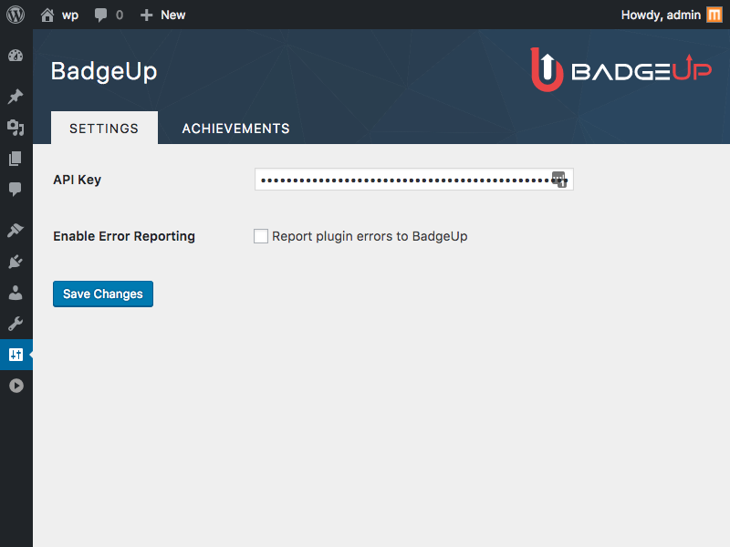

# BadgeUp WordPress Plugin

[](https://www.badgeup.io)

[](https://travis-ci.org/BadgeUp/badgeup-wordpress-plugin)

## Plugin Installation

From this repo...
1. Get `badgeup` directory and make it a zip archive
2. Log in to your WordPress dashboard
3. Navigate to the Plugins menu and click `Add New`
4. Click `Upload Plugin` and upload and install zipped `badgeup` directory

Use `badgeup` directory in this repo and upload it to `/wp-content/plugins` on your site and activate the plugin.

Alternatively, when available on wordpress.org,

1. Log in to your WordPress dashboard
2. Navigate to the Plugins menu and click `Add New`
3. Search for 'BadgeUp'
4. Click `Install now`

## Requirements

- PHP version 7.0.0 or greater
- MySQL version 5.6 or greater
- WordPress 4.4+

## Documentation

### Caching
Achievements are cached for 24 hours, to force reload add a query parameter `badgeup_reload_cache` to frontend page where achievements widget is visible.

OR

Got to achievement settings page Log in to WordPress the go to `Settings` > `BadgeUp` > `Achievements` tab then click `Reload achievements cache` button.

### Methods

#### `BadgeUp::notify( $notice )`

Adds an admin notice

Notice is display when next `admin_notices` hook is called.

Returns bool Success

##### Usage
```php
BadgeUp::notify( "Hi Admin! What's going on?" );
```

#### `badgeup_api()`

Get BadgeUp API object, to interact with API

Returns BadgeUp_API Instance

##### Usage
```php
$bup_api = badgeup_api();
$bup_api->create_event( 'event-name' ); // Call any BadgeUp_API method here
```

#### `BadgeUp_API->create_event( $event, $done = null )`

Creates a new event

Returns promise, which is resolved on `shutdown` hook.

* @param string $event Event key to create event with
* @param callable $done Called promise is fulfilled or rejected

Returns bool|Exception|Promise Exception or false on error and promise on success.

##### Usage
```php
badgeup_api()->create_event( 'namespace:subnamespace:event-name' );
```

#### `BadgeUp_API->api( $method, $args = [], $wait = true )`

Call methods on BadgeUp API client instance

By default resolves the promise right away and returns reponse (or Exception).

* @param 'getAchievement'|'getAchievements'|'getEarnedAchievements'|'createEvent' $method Method to call
* @param array $args Arguments for method
* @param bool $wait Whether or not to resolve the promise right away, true by default

Return Exception|mixed Exception on error and response on success.

##### Usage
```php
badgeup_api()->api( 'getEarnedAchievements', [ $user_id ] );
```

#### `BadgeUp_API->get_achievements()`

Get achievements array with name, description and icon of each achievement.
With achievement ID as key in the array

Returns array Achievements create on badgeup

**! Not to be confused with earned achievements which are subject specific.**\
This returns all achievements added by user in BadgeUp dashboard.

##### Usage
```php
$achievements = badgeup_api()->get_achievements();
```

### Development

#### Styling
This plugin uses Sass for styling.
* To watch for changes, run `npm run watch`
* To build it manually, run `npm run build`

### Testing

1. Install PHPUnit
2. Open plugin directory in command line
3. Setup tests
   ```bash
   bin/install-wp-tests.sh wordpress_test root '' localhost latest
   ```
4. Run tests
	```bash
	phpunit
	```

For more about testing, check out https://make.wordpress.org/cli/handbook/plugin-unit-tests/
